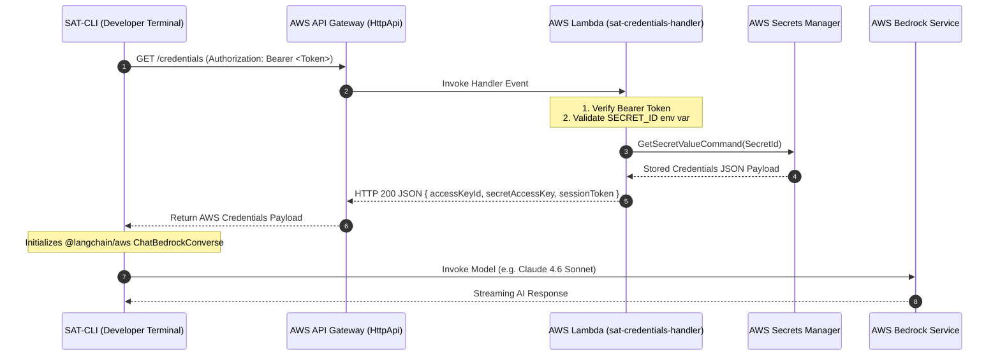

# SAT-Cloud-Service ☁️

Cloud backend service for **SAT-CLI** providing secure API Gateway and AWS Lambda endpoints for AWS Bedrock remote access.

---

## 🏗️ System Architecture

`sat-cloud-service` isolates AWS credential management and infrastructure access control from client machines. Developers using `sat-cli` do not need local AWS credentials; instead, `sat-cli` authenticates with `sat-cloud-service` to retrieve temporary or stored AWS Bedrock access keys.

### High-Level Architecture Diagram

```
+---------------------------------------------------------------------------------------+
|                                    SAT-CLOUD-SERVICE                                  |
|                                                                                       |
|  +------------------------+      +--------------------------+      +----------------+ |
|  |   AWS API Gateway      | ---> | AWS Lambda Handler       | ---> |  AWS Secrets   | |
|  |  (HttpApi GET /cred)   |      | (credentials-handler.ts) |      |    Manager     | |
|  +------------------------+      +--------------------------+      +----------------+ |
+--------------^-------------------------------------------------------------|----------+
               | 1. GET /credentials                                         | 2. Returns
               |    Header: Authorization: Bearer <Token>                    |    JSON Creds
               |                                                             v
+--------------+------------------------------------------------------------------------+
|                                                                                       |
|  +---------------------------------------------------------------------------------+  |
|  |                                  SAT-CLI                                        |  |
|  |               (Developer Terminal / CI/CD Execution Context)                    |  |
|  +---------------------------------------------------------------------------------+  |
|                                          |                                            |
+------------------------------------------|--------------------------------------------+
                                           |
                                           | 3. Direct Bedrock Model Invocation
                                           v
                        +------------------------------------+
                        |         AWS Bedrock Service        |
                        | (us.anthropic.claude-4-6-sonnet)   |
                        +------------------------------------+
```

### Detailed Sequence Diagram



---

## 📁 Repository Structure

```
sat-cloud-service/
├── src/
│   └── handlers/
│       └── credentials-handler.ts      # Lambda function handler
├── tests/
│   └── credentials-handler.test.ts    # Jest unit test suite
├── policies/
│   └── bedrock-invocation-policy.json # IAM Bedrock execution policy
├── template.yaml                      # AWS SAM infrastructure template
├── samconfig.toml                     # SAM CLI deployment parameters
├── jest.config.js                     # Jest testing configuration
├── tsconfig.json                      # TypeScript compilation configuration
└── package.json                       # Dependencies & npm scripts
```

---

## 🚀 Build, Test & Deployment Commands

### 1. Installation & Local Build

```bash
# Install dependencies
npm install

# Compile TypeScript to dist/
npm run build

# Run unit tests (Jest)
npm test
```

### 2. Deployment via AWS SAM CLI

```bash
# Build SAM artifact
npm run sam:build   # Runs: npm run build && sam build

# Deploy to AWS Account
npm run sam:deploy  # Runs: sam deploy
```

During `sam deploy` (or `sam deploy --guided`), configure parameters:
* **SecretId**: Name or ARN of secret in AWS Secrets Manager (default: `saturam-bedrock-credentials`).
* **ExpectedToken**: Optional Bearer token for client API authorization.

---

## 🔐 IAM Policy Configuration

Attach the IAM policy located in [`policies/bedrock-invocation-policy.json`](file:///home/sp/sat_cli/sat-cloud-service/policies/bedrock-invocation-policy.json) to the IAM User or Role whose credentials are stored in Secrets Manager:

- `bedrock:InvokeModel`
- `bedrock:InvokeModelWithResponseStream`
- `bedrock:GetInferenceProfile` & `bedrock:ListInferenceProfiles`

---

## 🔗 SAT-CLI Integration

Configure SAT-CLI using:

```bash
sat-cli init
```

1. Select **AWS Bedrock (Remote)**.
2. Enter your API Gateway URL: `https://<api-id>.execute-api.<region>.amazonaws.com/credentials`.
3. Enter your optional Bearer Token.
